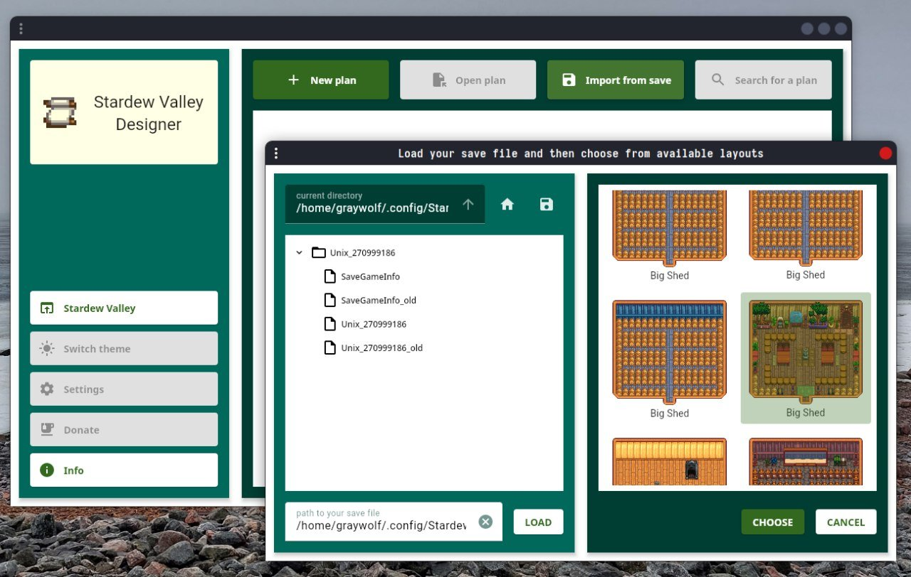
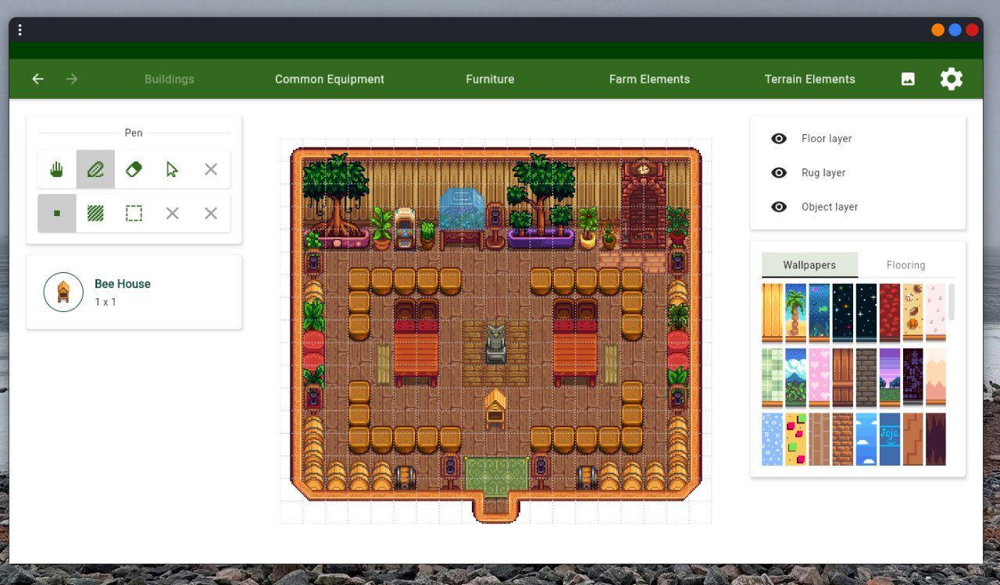

# Stardew Valley Designer

[](https://github.com/AzimMuradov/stardew-valley-designer/releases/latest)
[](https://github.com/AzimMuradov/stardew-valley-designer/actions/workflows/build.yml)
[](https://github.com/AzimMuradov/stardew-valley-designer/actions/workflows/test.yml)
[](https://www.apache.org/licenses/LICENSE-2.0)

The goal of this project is to provide a finely tuned editor for designing your farm and the interior of all its
buildings.

## Installation

Latest release - https://github.com/AzimMuradov/stardew-valley-designer/releases/latest.

### Windows

Windows (exe file, 64-bit)

### Linux

Ubuntu/Debian (deb file, 64-bit)

### MacOS

Currently not supported

## Features

- Working layout editor (currently for shed, big shed and standard farm only)
- Basic editor tools (hand, pen, eraser, select)
- Layers support
- History manager (undo, redo)
- Savedata import
- Ability to save plan as an image

There are currently no way to save the plan for later modifications. It's currently the #1 priority.





## Roadmap

[ROADMAP](docs/user/ROADMAP.md)

## Support

If you encounter a bug or have any questions, please let me
know - https://github.com/AzimMuradov/stardew-valley-designer/issues.

## Acknowledgements

Stardew Valley is developed by **ConcernedApe** and self-published on most platforms.

Most of the sprites and icons used in this app, including the app icon, are from the original game.

## Authors

- [@AzimMuradov](https://www.github.com/AzimMuradov)

## License

For the source code (without the resources).

```
Copyright 2021-2023 Azim Muradov

Licensed under the Apache License, Version 2.0 (the "License");
you may not use this file except in compliance with the License.
You may obtain a copy of the License at

       http://www.apache.org/licenses/LICENSE-2.0

Unless required by applicable law or agreed to in writing, software
distributed under the License is distributed on an "AS IS" BASIS,
WITHOUT WARRANTIES OR CONDITIONS OF ANY KIND, either express or implied.
See the License for the specific language governing permissions and
limitations under the License.
```
