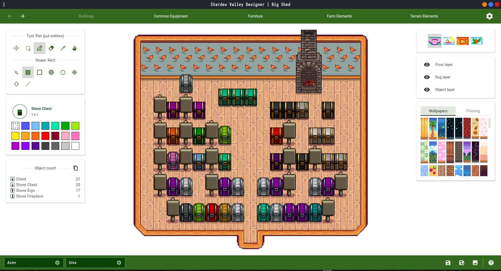
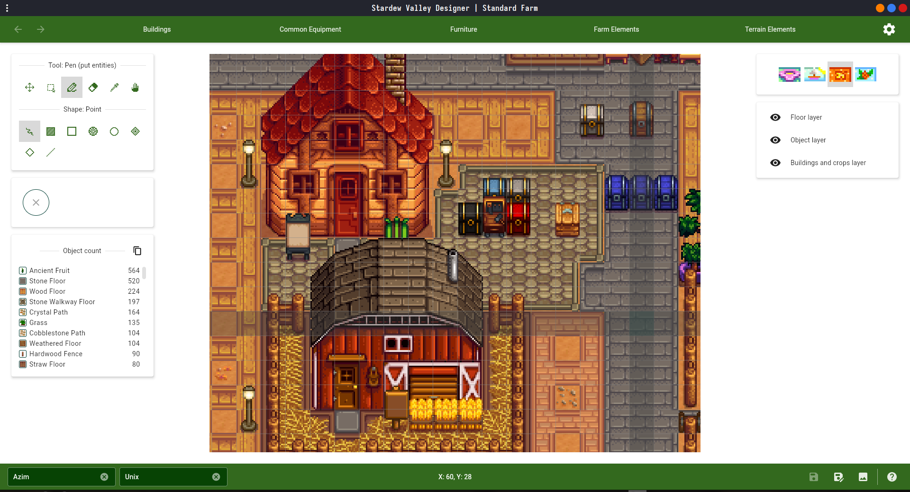
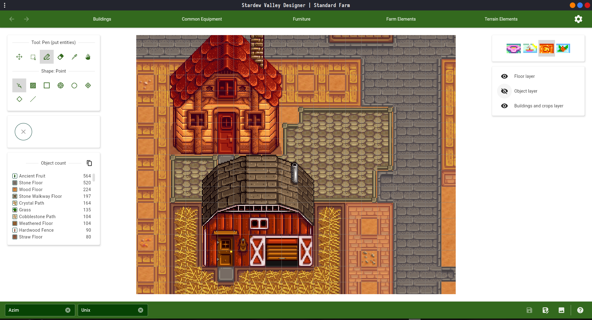
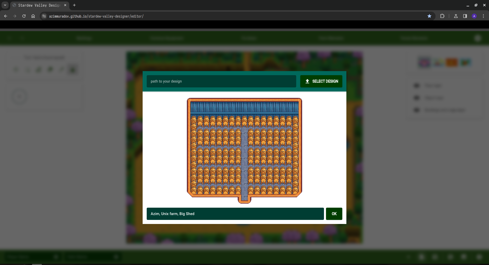
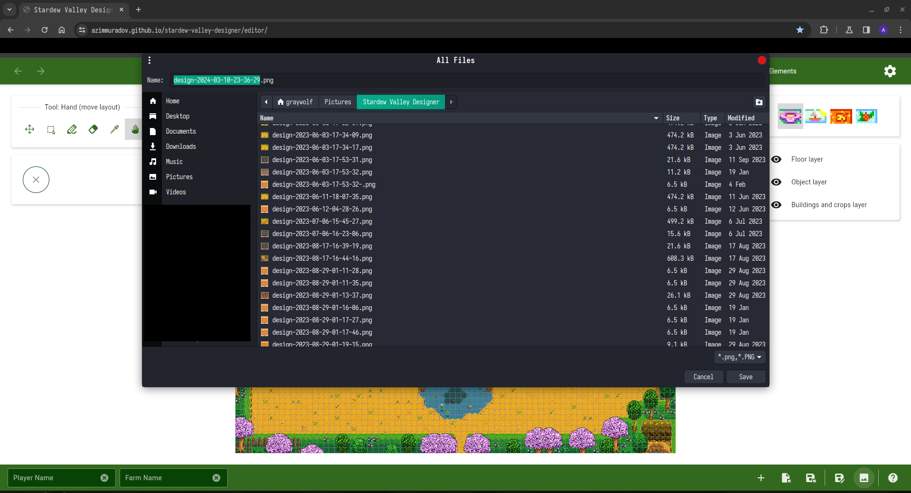

# Stardew Valley Designer

[](https://azimmuradov.github.io/stardew-valley-designer/download.html)
[](https://github.com/AzimMuradov/stardew-valley-designer/actions/workflows/build.yml)
[](https://github.com/AzimMuradov/stardew-valley-designer/actions/workflows/test.yml)
[](https://www.apache.org/licenses/LICENSE-2.0)

Stardew Valley Designer is a free and open-source Stardew Valley farm editor.
The goal of this project is to provide a finely tuned, feature-rich editor for designing your farm and the interior of all its buildings.

**Website**: [azimmuradov.github.io/stardew-valley-designer](https://azimmuradov.github.io/stardew-valley-designer).

> [!NOTE]
> The app aims to support the latest version of Stardew Valley (**1.5.6**).
>
> Other versions may have little or no support.

## :package: Desktop installation

Latest release: [azimmuradov.github.io/stardew-valley-designer/download.html](https://azimmuradov.github.io/stardew-valley-designer/download.html).

**Currently supported platforms**:

- Windows (x86-64)
  - Windows 10 version 1709 ("Fall Creators Update", October 2017) or higher
  - Windows 11
- Linux (x86-64)
  - Debian family

## :globe_with_meridians: Web editor

Online editor: [azimmuradov.github.io/stardew-valley-designer/editor](https://azimmuradov.github.io/stardew-valley-designer/editor).

> [!WARNING]
> Web version is experimental and may contain bugs.

**Currently supported browsers**:

- Chrome 119 or higher
- Firefox 120 or higher
- Chromium based browsers (based on Chromium 119 or higher)
  - Opera
  - Brave
  - Microsoft Edge
  - ...

## :sparkles: Features

- Working editor for various layouts
- Savedata import
- Ability to save design as an image
- Basic editor tools (hand, drag, pen, eraser, select, eye dropper)
- Various shapes for pen, eraser and select
  - rectangle, rectangle outline
  - ellipse, ellipse outline
  - diamond, diamond outline
  - line
- History manager (undo, redo)
- Layers support
- Furniture support
- Wallpapers and flooring support
- Chest colors support
- Toggleable "area of effect" hints for scarecrows, sprinklers, bee houses, and junimo huts
- Accurate real-time rendering
- Map zoom (using scroll)

### :construction: Experimental design saves

Ability to save and import designs.

> [!WARNING]
> Currently, design saves may be backward incompatible with subsequent releases.

## :framed_picture: Screenshot gallery

### :desktop_computer: Desktop



<details>
  <summary>More screenshots</summary>






</details>

### :globe_with_meridians: Web


<details>
  <summary>More screenshots</summary>





</details>

## :memo: Changelog & Roadmap

[CHANGELOG](docs/user/CHANGELOG.md)

[ROADMAP](docs/user/ROADMAP.md)

## :speech_balloon: Support

If you encounter a bug or have any questions,
please let me know - https://github.com/AzimMuradov/stardew-valley-designer/issues.

## :star2: Acknowledgements

Stardew Valley is developed by **ConcernedApe** and self-published on most platforms.

Most of the sprites and icons used in this app, including the app icon, are from the original game.

## :busts_in_silhouette: Authors

- Desktop & Web application: [Azim Muradov](https://www.github.com/AzimMuradov)
- Website: [Vladislav Andronov](https://github.com/AndrVLDZ)

## :scroll: License

For the source code (without the resources).

```
Copyright 2021-2024 Azim Muradov

Licensed under the Apache License, Version 2.0 (the "License");
you may not use this file except in compliance with the License.
You may obtain a copy of the License at

       http://www.apache.org/licenses/LICENSE-2.0

Unless required by applicable law or agreed to in writing, software
distributed under the License is distributed on an "AS IS" BASIS,
WITHOUT WARRANTIES OR CONDITIONS OF ANY KIND, either express or implied.
See the License for the specific language governing permissions and
limitations under the License.
```
