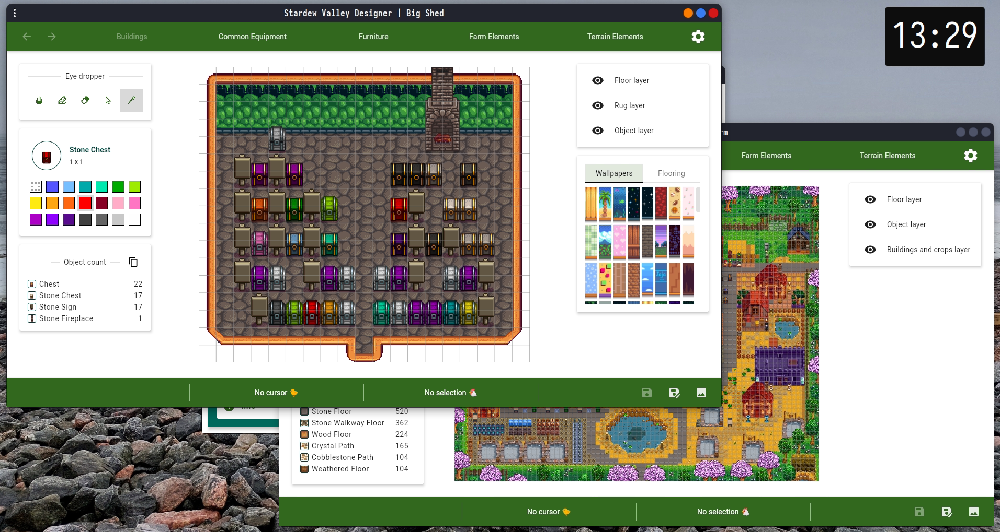
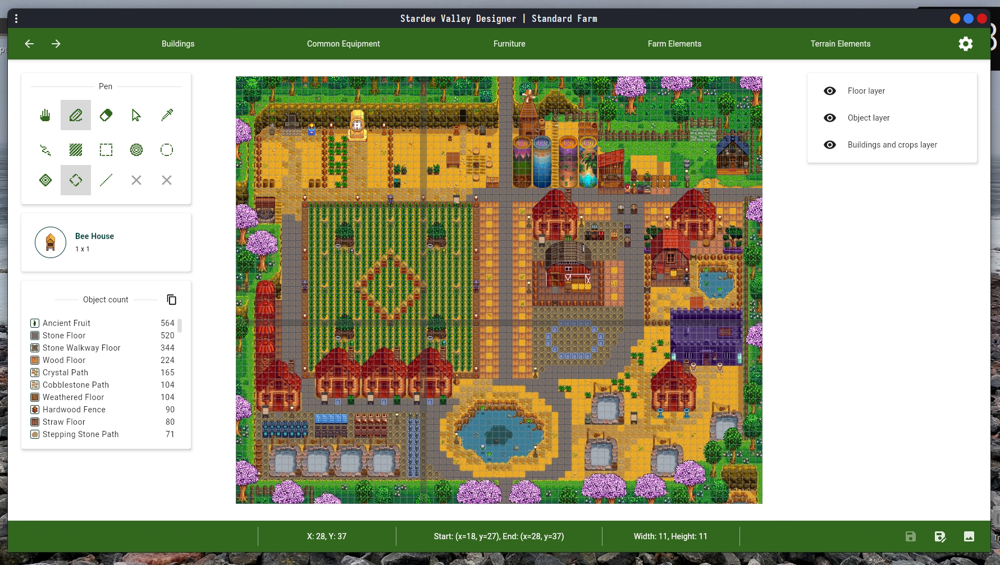

# Stardew Valley Designer

[](https://azimmuradov.github.io/stardew-valley-designer/download.html)
[](https://github.com/AzimMuradov/stardew-valley-designer/actions/workflows/build.yml)
[](https://github.com/AzimMuradov/stardew-valley-designer/actions/workflows/test.yml)
[](https://www.apache.org/licenses/LICENSE-2.0)

The goal of this project is to provide a finely tuned editor for designing your farm and
the interior of all its buildings.

## Desktop installation

Latest release - https://azimmuradov.github.io/stardew-valley-designer/download.html.

**Currently supported platforms**:

- Windows (x86-64)
  - Windows 10 version 1709 ("Fall Creators Update", October 2017) or higher
  - Windows Server 2019 LTSC or higher
  - Windows Enterprise 2019 LTSC or higher
  - Windows 11
- Linux (x86-64, glibc 2.14+ (released 2011))
  - Debian family

> [!NOTE]
> The app aims to support the latest version of Stardew Valley (**1.5.6**).
>
> Other versions may have little or no support.

## Features

- Working layout editor (currently for shed, big shed and standard farm only)
- Basic editor tools (hand, pen, eraser, select, eye dropper)
- Layers support
- Furniture support
- History manager (undo, redo)
- Savedata import
- Ability to save design as an image

### Experimental design saves

Ability to save and import designs (currently only works on desktop).

> [!WARNING]
> Design saves may be backward incompatible with subsequent releases.

### Experimental web version

https://azimmuradov.github.io/stardew-valley-designer/svd/editor

**Currently supported browsers**:

- Chrome 119 or higher
- Firefox 120 or higher
- Chromium based browsers (based on Chromium 119 or higher)
  - Opera
  - Brave
  - Microsoft Edge
  - ...

**Currently missing functionality**:

- No layout selection
- No savedata import
- No ability to save design as an image

## Screenshots

### Desktop






## Changelog & Roadmap

[CHANGELOG](docs/user/CHANGELOG.md)

[ROADMAP](docs/user/ROADMAP.md)

## Support

If you encounter a bug or have any questions,
please let me know - https://github.com/AzimMuradov/stardew-valley-designer/issues.

## Acknowledgements

Stardew Valley is developed by **ConcernedApe** and self-published on most platforms.

Most of the sprites and icons used in this app, including the app icon, are from the original game.

## Authors

- [@AzimMuradov](https://www.github.com/AzimMuradov)

## License

For the source code (without the resources).

```
Copyright 2021-2024 Azim Muradov

Licensed under the Apache License, Version 2.0 (the "License");
you may not use this file except in compliance with the License.
You may obtain a copy of the License at

       http://www.apache.org/licenses/LICENSE-2.0

Unless required by applicable law or agreed to in writing, software
distributed under the License is distributed on an "AS IS" BASIS,
WITHOUT WARRANTIES OR CONDITIONS OF ANY KIND, either express or implied.
See the License for the specific language governing permissions and
limitations under the License.
```
